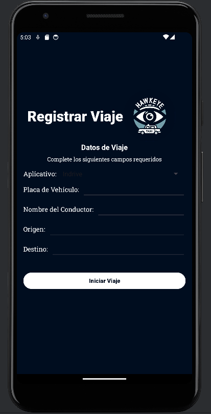
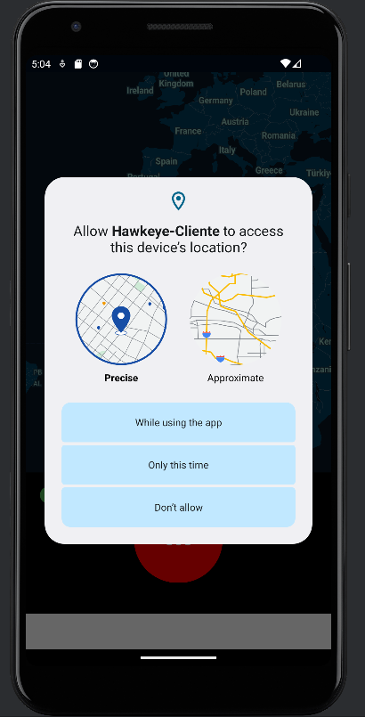
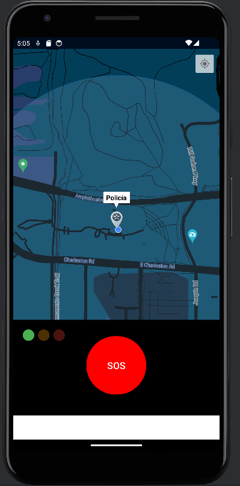

# Hawkeye-Cliente :eye:
Versión para el cliente de la aplicación Hawkeye.
**Hawkeye** es una aplicación móvil diseñada para conectar a los ciudadanos con las autoridades policiales de manera eficiente. Permite a los usuarios ver la ubicación de los policías más cercanos y enviar información sobre su estado actual durante un viaje en taxi, facilitando una respuesta rápida en situaciones de emergencia.

## Estado del Proyecto :construction:
Esta es una versión funcional pero en desarrollo de Hawkeye. Aunque la funcionalidad principal está implementada, el diseño visual y algunos menús aún están en proceso de mejora. Agradecemos cualquier sugerencia para optimizar la experiencia del usuario.

## Aplicación Cliente :iphone:
### HawkEye-Client
La app del cliente permite:
- Ingresar datos del viaje.
- Ver un mapa con su ubicación y la de los policías cercanos.
- Enviar alertas de ayuda a los policías.
- Cancelación de alertas mediante biometría.

**Nota**: Algunas interfaces y elementos visuales pueden cambiar en versiones futuras.

## Reconocimientos :handshake:

- **Programación**: Esta versión fue desarrollada íntegramente por mí, Estefano Quito Villanueva, quien se encargó de toda la programación y la implementación de las funcionalidades principales de la aplicación.
- **Colaboradores**:
  - **Farfan Arroyo Henry Marcell**: Desarrolló la versión final de la aplicación, incorporando elementos visuales adicionales y extendiendo la funcionalidad. Mejoró significativamente la interfaz de usuario, refinó la experiencia visual y también implementó varias mejoras funcionales, logrando una versión casi completa y pulida del proyecto.
  - **Bautista Rodriguez Ricardo; Castillo Idrogo Robinson y Gallardo Aguilar Aldo**: Contribuyeron significativamente en el inicio del proyecto, incluyendo la identificación de requisitos funcionales y no funcionales, la elaboración de diagramas (de flujo, de bases de datos, etc.), y la creación de toda la documentación necesaria para el desarrollo. También colaboraron en la definición de prototipos y en el desarrollo de historias de usuario.
 
## Capturas de Pantalla :camera:

### Pantalla Principal

### Pantalla Permisos

### Hawkeye

